# Food Ordering Service

## Technologies used:
 - Ajax
 - React
 - Laravel

Free css template is taken from [here](https://themewagon.com/thank-you-for-downloading/?item_id=65812&dl=S1psNFo3ZTZ2U0svVWR6U0w5Snc5elFVUXBySW9hSFlhZktlOVpEMTVqZkVRc0dGNEk2eEljYzd1eHQ2RDhpQg==) , 
credits for it goes to its author.

My part is 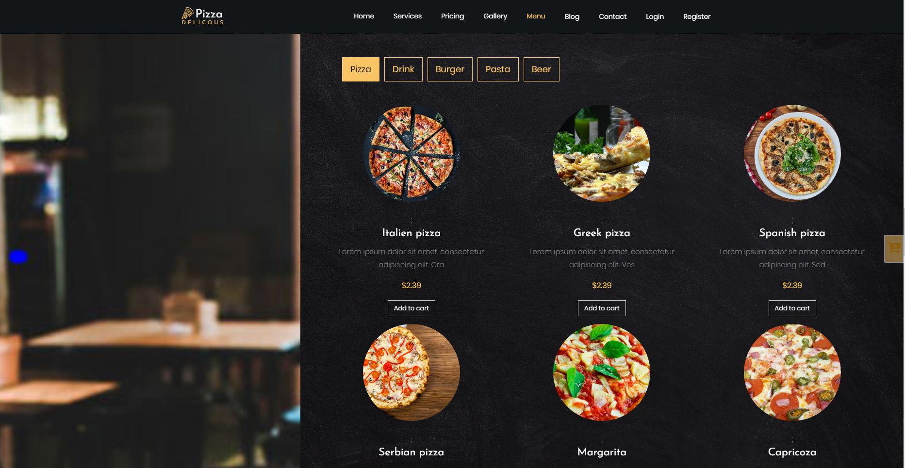. 
A listing of articles divided by their type, e.g. pizzas, drinks, burgers and pastas, in singular.
By clcking on particular tab, it lists all elements of particular type. Ex. if you click on `pasta`, it will list only pastas and so on ...

This only list pastas:
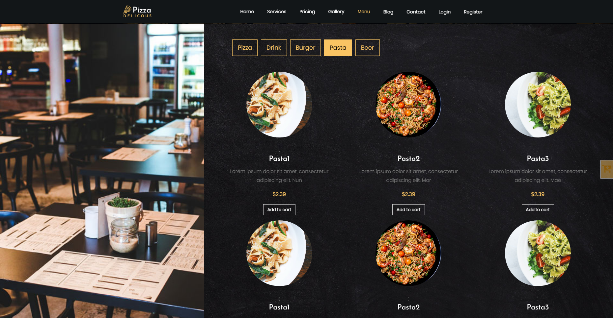

Other example listing are same in nature.

While deplying on Heroku i encountered problem which is well explained in this [SO post](https://stackoverflow.com/questions/50082602/heroku-accesing-laravel-storage-folder) accepted answer. Couldn't get around, since some solutions suggested list having some sort amazon host service for which is required credit card? which i don't have. Symlinks in project and heroku work, so there it is.

Fixed to right side is shopping basket.
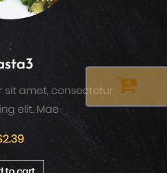
By hovering over, it pops out.

Basket showing how many articles are present:
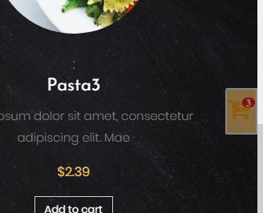

If you click on it it shows articles which can be removed from basket.
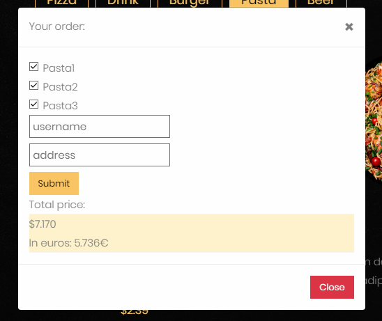

It shows list of articles which can be removed and total price will be recalculated(dollars and euros).
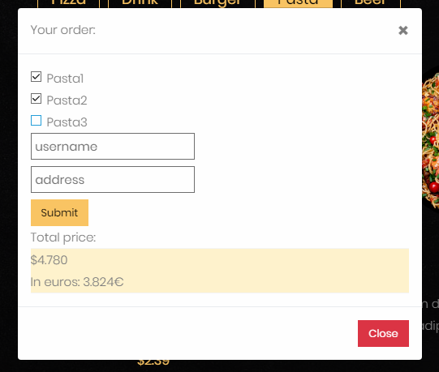
Prices and total price is still recorded in db only in dollars. 

Login and register actions are classic from Laravel. Only thing added is address field during registration proccess. There are no checks for address except that it is required.

It is alsop said in pdf containing instructions, that user don't have to registered one to order stuff so i had to improvise. During checkout for unregistered user i.e. "customer" he/she is automatically added along with data entered(name and address) in customers table. Customers table is for customers and users table is for registered users who can also be customers, that how i saw it.

Articles table:
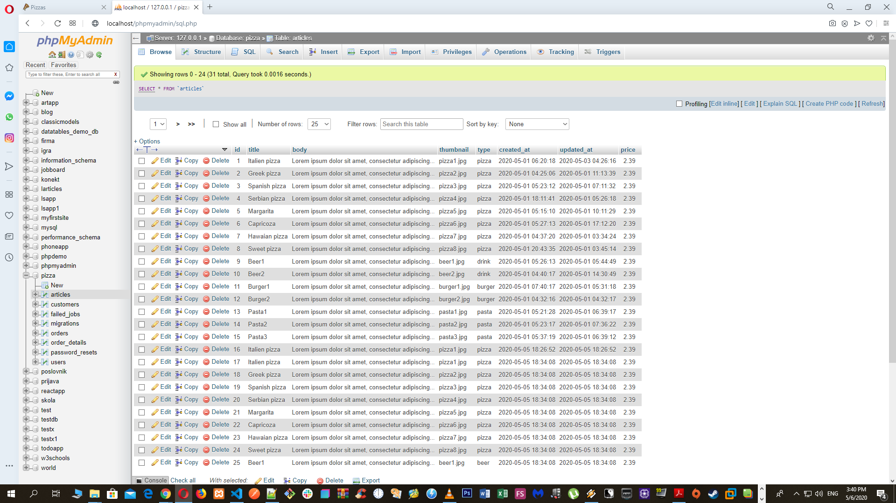  

Users table:
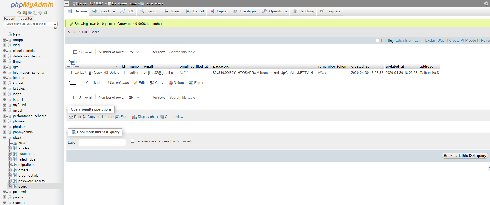

Customers table:
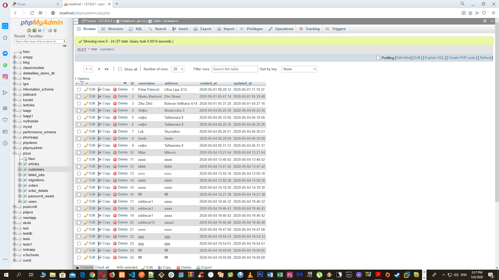  

After check out, besides customer, there are also orders table and order_details table.

Orders table contain an id of particular order along with customer who order it, total_price of articles and fields when it's created and updated(timstamp fields from Laravel).
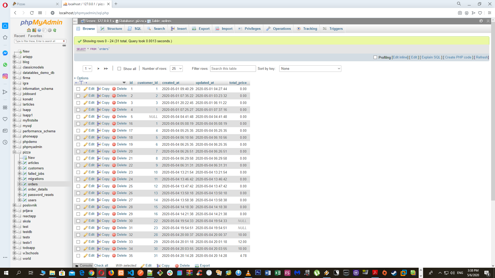 

Order_details table contain order_id along with article_id, quantity of said article and timestamps.
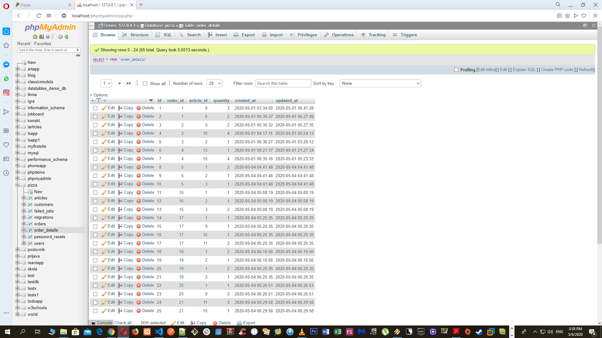 

Everyone of these tables are connected via foreign keys and with appropriate Laravel relationships.

Database schema:
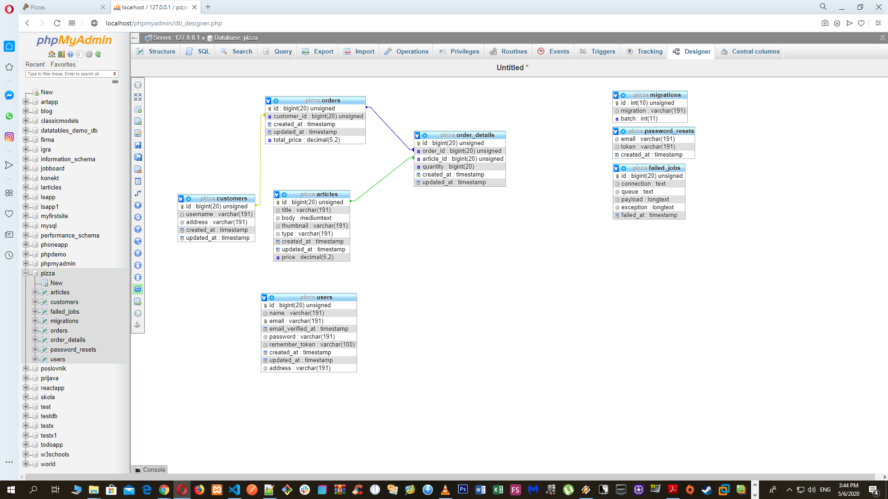 

If user is registered and logged in:
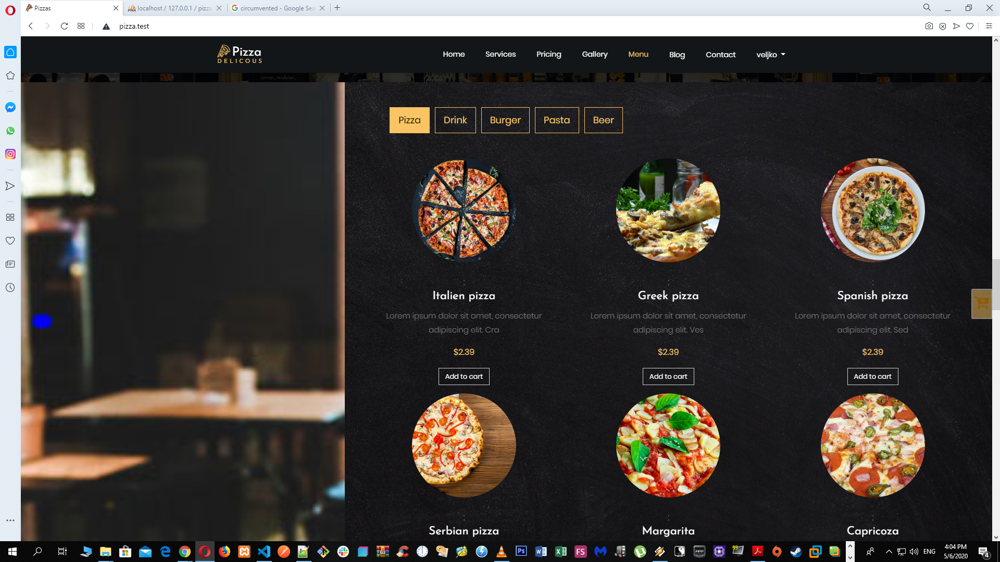 

For anyone wanting to see how it looks live with db and all, you can check it out at [Heroku](https://pizzzas.herokuapp.com/)
as i said, Heroku has it's own set of peculiarities which i couldn't resolve at the time. And it's my first time ever using Heroku.

Notice: Heroku's issues for file uploads can be circumvented by uploadind directly into public folder of Laravel project, but consulting docs and various forums posts, it's not "by the book" thing to do so to speak. I've done file uploads with symlinks and everything Laravel before, but only on shared hosting, see my "MyTube" app. True, it miserable hosting with free plan, but it works as any other shared hosting.

